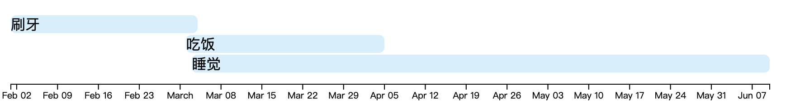

# vue3-simple-timeline

a simple timeline, from[vue-timeline-component](https://github.com/0xdv/vue-timeline-component) upgrade vue3

## Installation

```bash
pnpm add -D vue3-simple-timeline
```

## Use

```vue
<template>
  <vue-timeline :data="events"></vue-timeline>
</template>

<script setup>
import VueTimeline from "vue3-simple-timeline"
import { ref } from "vue"

const events = ref([{
  name: "event 1",
      start: new Date(2020, 1,1),
      end: new Date(2020, 1,4),
  },{
      name: "event 2",
      start: new Date(2020, 1,2),
      end: new Date(2020, 1,5),
  },{
      name: "event 3",
      start: new Date(2020, 1,3),
      end: new Date(2020, 1,10),
  }])

</script>
```

## show
